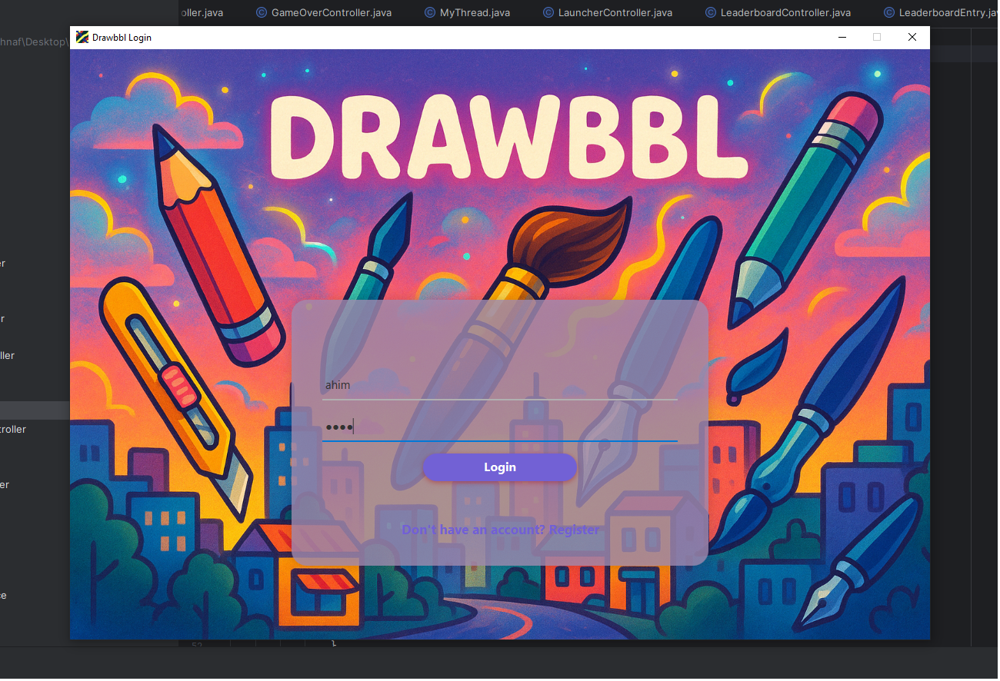
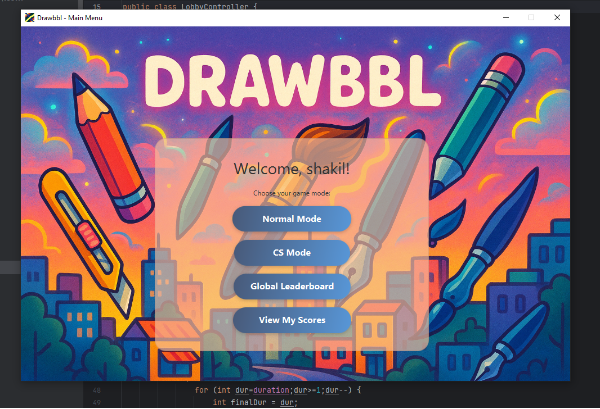
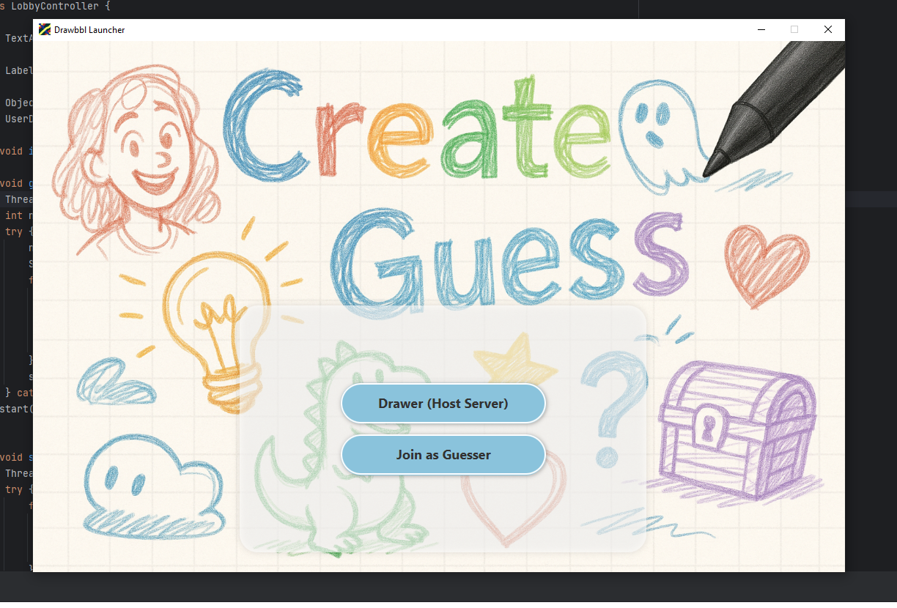
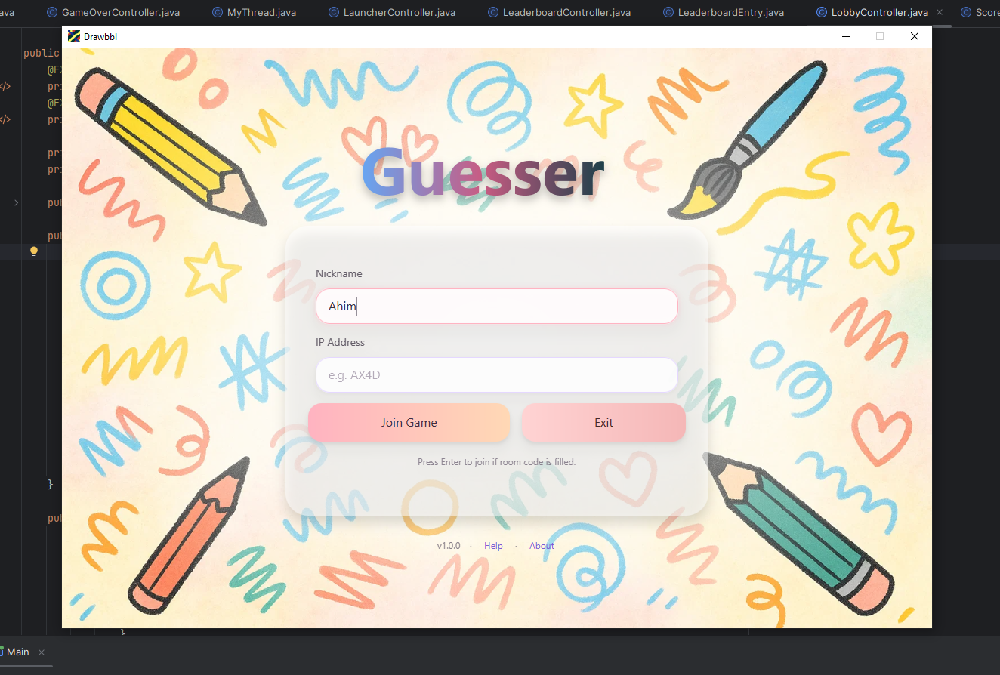
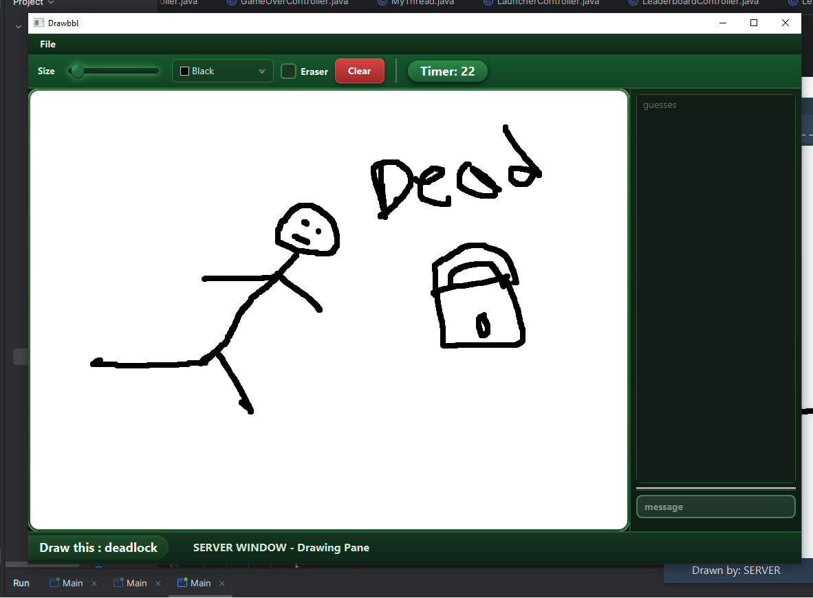
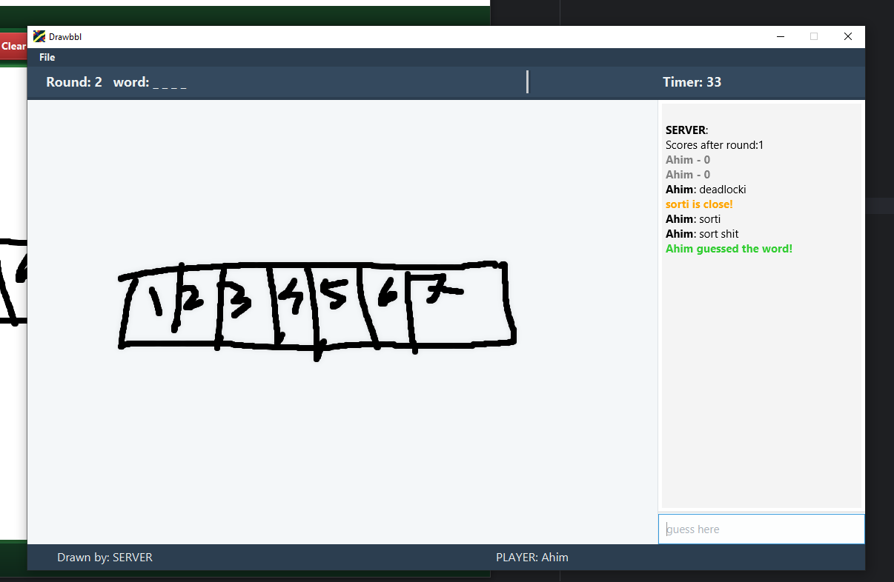
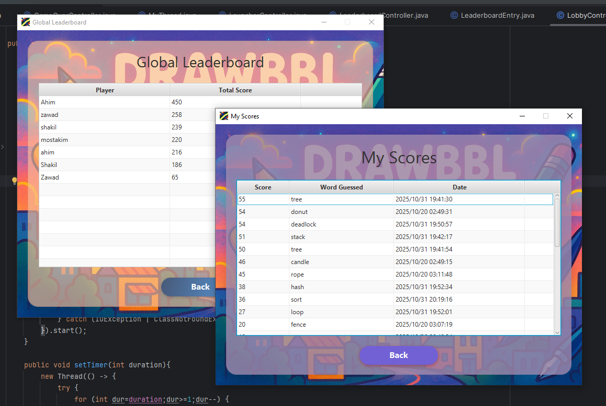

**Drawbbl** is a Pictionary-style multiplayer game built with **JavaFX**. Players can draw and guess words just like *Skribbl*, making it a creative and fun experience for everyone.

---

##  Features

- ✏️ **Drawing and Guessing Gameplay** – One player draws while others guess the word.
- 💡 **Clue System** – A clue appears **30 seconds** before the round ends.
- 🔠 **Edit Distance Check** – Detects close guesses and gives hints when players are almost correct.
- 🔐 **Login & Account System** – Create an account or log in to save your progress.
- 🎮 **Two Game Modes**
  - **Normal Mode** – Random fun words.
  - **CS Mode** – Words related to **Computer Science**, designed for CSE students.
- 👥 **Role Selection** – Choose to play as a **Drawer** or a **Guesser**.
- 🌐 **Join by IP** – Guessers can join using their **name** and the **drawer’s IP address**.
- 🏆 **Score System** – Earn points for correct guesses and compete with others.

## 🎥 Demo Video

You can include your gameplay video here:

[🎬 Watch Gameplay Video](assets/video.mp4)

Or link your YouTube demo:

- (Click the image to watch the gameplay video on YouTube!)

---

## ⚙️ How to Play
- After Downloading
1. **Login or create an account.**
2. **Select a game mode** – Normal or CS Mode.
3. Choose your **role** – Drawer or Guesser.
4. If you’re a guesser, enter your **name** and the **drawer’s IP address** to join.
5. Start drawing or guessing, use the clues, and try to get the highest score!

---

## 🧰 Built With

- **JavaFX** – For the user interface and gameplay.
- **Java Socket Programming** – For real-time multiplayer connections.

---

## 🖼️ Screenshots

  
  

  
  

  
  

  

---

## 💬 About

**Drawbbl** was created as a fun and interactive JavaFX project that blends creativity, teamwork, and programming.  
It’s a simple yet enjoyable way to play, learn, and connect with others. 🎨💻
"""
